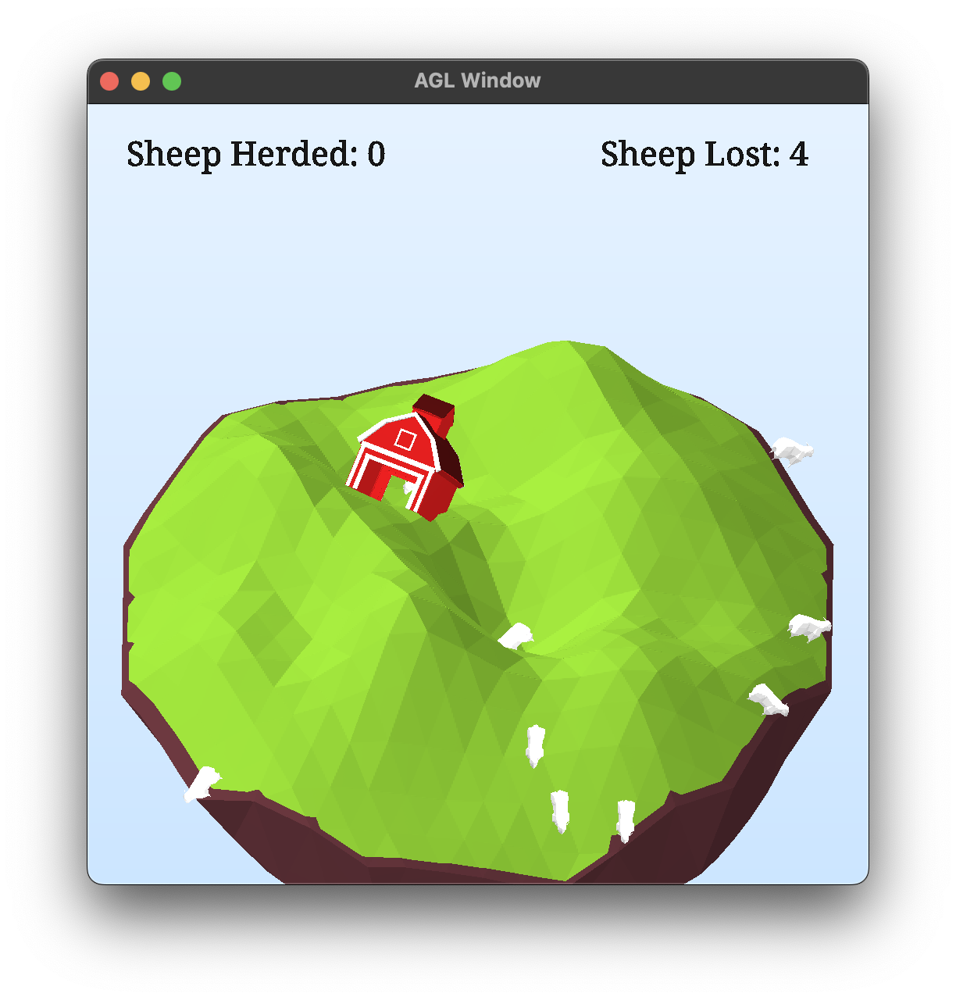

# Non-Convex Optimization: The Game



# Screen Recording

<video src="readme_assets/recording.mov"></video>

## How to build

*Windows*

Open git bash to the directory containing this repository.

```
mesh-viewer $ mkdir build
mesh-viewer $ cd build
mesh-viewer/build $ cmake ..
mesh-viewer/build $ start mesh-viewer.sln
```

```
mesh-viewer/build $ ../bin/Debug/mesh-viewer.exe
```

*macOS*

Open terminal to the directory containing this repository.

```
mesh-viewer $ mkdir build
mesh-viewer $ cd build
mesh-viewer/build $ cmake ..
mesh-viewer/build $ make
```

To run each program from build, you would type

```
mesh-viewer/build $ ../bin/mesh-viewer
```

## How to Play
The goal is to herd as many sheep as you can into the barn. Sheep only move downhill.
Use the `<` and `>` keys (AKA `,` and `.`) to deform the terrain so that "downhill" happens to be in the direction of the barn. Don't let the sheep fall off the edge of the island.

When all sheep are lost/herded, press `r` to reset the scene.

## How it Works
### Terrain
The terrain is generated using 3D Perlin noise from the FastNoise library. When you deform the terrain using the `<` and `>` keys, you are simply changing which cross-section of the noise is sampled for the terrain heightmap.

### Sheep Behavior and Animation
Sheep decide where to move based on the gradient of the terrain at their current location. The gradient is calculated based on the terrain surface normal.

Sheep are animated using a custom `Animation` class which contains a series of keyframes which are added each time the sheep needs to move.

During their jumps downhill, their rotation animates to match the normal of their new location. This part of the animation is performed using spherical linear interpolation.

### Camera
The camera controls are based on the orbit camera from the mesh-viewer assignment. However, the camera is now orthographic, rather than perspective. 

### Shading
The scene has three lights to provide more uniform illumination. The diffuse and specular components of each object's shading are calculated based on the sum of light received from these three sources.

All elements are shaded using their surface normals, so that their polygons are more visible. This is done to make it easier to predict the direction that the sheep will walk.

Instead of using texture maps or vertex colors, all multicolor objects (island and barn) are shaded procedurally using a series of conditionals based on normals and position.